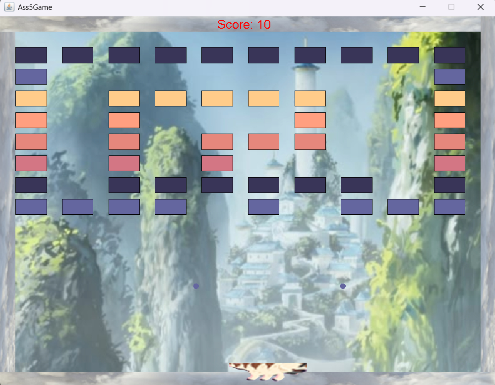

# Arkanoid Java - ATLA Themed Edition

## Description
This Arkanoid game is inspired by *Avatar: The Last Airbender* (ATLA) with a unique atmospheric twist.  
The player controls a paddle that looks like Appa, set against the Air Temple background with cloud-bordered edges.  

## Features
- Paddle designed as Appa that the player can move left and right.
- Blocks come in different colors; when the ball hits a block, it changes color to match the block’s color.
- Block is removed only when the balls that hit it are a different color.
- A "Death Zone" at the bottom — if the ball falls here, you lose a chance.
- Score tracking: each block broken is worth 5 points.
- Immersive ATLA-themed visuals combined with classic Arkanoid gameplay.
- Background features the Air Temple with clouds as borders.

## How to Play
- Move the Appa paddle using arrow keys.
- Bounce the ball to hit and break blocks in different color than the ball.
- The ball changes color depending on the block it hits.
- Prevent the ball from falling into the Death Zone at the bottom.
- Score points by breaking blocks; each block adds 5 points.
- WIN by removing all the blocks.

## Getting Started

### Prerequisites
- Java JDK 8 or higher
- Java IDE (IntelliJ IDEA, Eclipse) or Apache Ant installed

### Running the Game

You can run the game by opening and running `ass5game.java` in your IDE.

Alternatively, using Apache Ant:

- To compile the project, run:
ant compile

- To run the game, run:
ant run

## Preview

